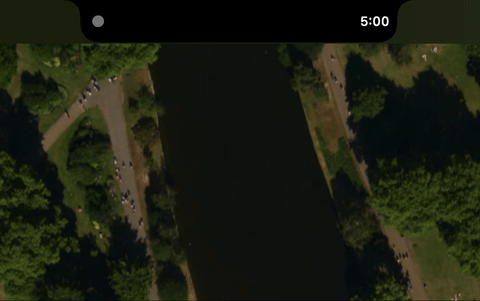

# Bezel

A notch app for Mac.




## About

Bezel is a simple notch-area utility for MacBooks with a notch. It sits in your menu bar notch and provides quick access to a pomodoro timer.

Inspired by : 
- [Alcove](https://tryalcove.com/faqs)
- [Oak](https://www.oakfocus.co/)

(please buy those beautiful apps. These are by excellent designers and they maintain and expand their software!)

## Development

This project was built as an experiment in AI-assisted development:

- **Cost:** ~$15.00 in Claude Opus 4.5 credits
- **Time:** ~2 hours of back-and-forth
- **Result:** First working version

## Building

```bash
# Build
./run.sh build

# Run
./run.sh run

# Build and run
./run.sh br
```

## License

MIT
